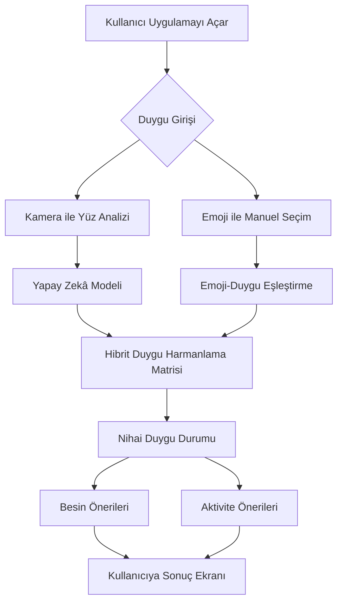
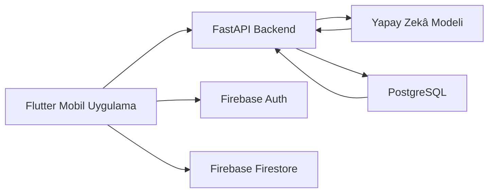

# 🧠 Duygu Durumu Analizi ile Kişiselleştirilmiş Beslenme ve Aktivite Önerisi Sunan Yapay Zekâ Destekli Mobil Uygulama

<p align="center">
  <a href="https://github.com/yorukokan/Duygu-Tabanli-Oneri-Mobil-Uygulama">
    
  </a>
  <a href="https://erbakan.edu.tr/tr/birim/bilgisayar-muhendisligi-bolumu/anasayfa">
    
  </a>
  
  
  
</p>

---

## 📌 Proje Hakkında

Bu proje, kullanıcının anlık duygu durumunu analiz ederek kişiselleştirilmiş **beslenme** ve **aktivite önerileri** sunan yapay zekâ destekli bir mobil uygulamadır.

Geleneksel sağlık uygulamaları çoğunlukla kalori, adım sayısı, kilo takibi veya egzersiz geçmişi gibi fiziksel verilere odaklanır. Bu uygulama ise kullanıcının **zihinsel durumunu** da öneri sürecine dahil eder.

Sistem; kullanıcının yüz ifadesinden veya manuel emoji seçiminden elde edilen duygu bilgisini değerlendirir ve bu duyguya uygun yiyecek, içecek ve aktivite önerileri üretir.

---

## 🎯 Projenin Amacı

Projenin temel amacı, bireylerin anlık ruh haline göre daha sağlıklı, uygulanabilir ve kişiselleştirilmiş öneriler sunan bütünsel bir dijital destek sistemi geliştirmektir.

Bu kapsamda sistem:

- Kullanıcının duygu durumunu analiz eder.
- Duygu sonucuna göre beslenme önerileri sunar.
- Duygu sonucuna göre aktivite önerileri üretir.
- Kamera kullanmak istemeyen kullanıcılar için emoji tabanlı alternatif giriş sağlar.
- Kullanıcının geçmiş duygu kontrollerini ve uygulama etkileşimlerini saklar.
- Mobil cihazlarda sade, hızlı ve kullanıcı dostu bir deneyim sunar.

---

## ✨ Özgün Değer

Bu projenin özgün değeri, fiziksel sağlık verileri ile zihinsel durumu aynı karar mekanizması içinde değerlendirmesidir.

Uygulama yalnızca “ne yemelisin?” veya “ne yapmalısın?” sorusuna cevap vermez. Kullanıcının mevcut ruh halini dikkate alarak daha anlamlı ve uygulanabilir öneriler üretir.

### Öne Çıkan Noktalar

| Özellik | Açıklama |
|---|---|
| 🧠 Duygu Analizi | Kullanıcının yüz ifadesi veya emoji seçimiyle ruh hali tespit edilir. |
| 🍽️ Beslenme Önerisi | Duygu durumuna uygun yiyecek/içecek önerileri sunulur. |
| 🏃 Aktivite Önerisi | Kullanıcının ruh haline uygun fiziksel veya rahatlatıcı aktiviteler önerilir. |
| 🔀 Hibrit Karar Mekanizması | Yapay zekâ sonucu ile emoji seçimi birlikte değerlendirilir. |
| 📱 Mobil Öncelikli Tasarım | Flutter ile Android ve iOS uyumlu yapı hedeflenmiştir. |
| 🗄️ Hibrit Veri Mimarisi | PostgreSQL ve Firebase birlikte kullanılır. |

---

## 🧩 Sistem Nasıl Çalışır?

Sistem genel olarak aşağıdaki akışla çalışır:



---

## 🧠 Yapay Zekâ ve Duygu Analizi

Projede yüz ifadelerinden duygu tespiti için derin öğrenme tabanlı görüntü işleme yaklaşımı kullanılmıştır.

### Kullanılan Yaklaşım

- **Model tipi:** CNN tabanlı yüz ifadesi sınıflandırma
- **Veri seti:** FER-2013
- **Duygu sınıfları:**
  - Angry
  - Disgust
  - Fear
  - Happy
  - Sad
  - Surprise
  - Neutral

FER-2013 veri seti; mutlu, üzgün, öfkeli, korkmuş, şaşkın, iğrenme ve nötr olmak üzere yedi temel duygu sınıfını kapsar.

---

## 🔀 Hibrit Duygu Tespit Modeli

Uygulama yalnızca kamera analizine bağlı değildir. Kullanıcı isterse duygu durumunu emoji seçerek manuel olarak da belirtebilir.

Bu yapı iki nedenle önemlidir:

1. Kullanıcı kamera kullanmak istemeyebilir.
2. Yapay zekâ tahmini ile kullanıcının gerçek hissi farklı olabilir.

Bu yüzden sistem, iki farklı girdiyi birlikte değerlendirir:

| Girdi Kaynağı | Açıklama |
|---|---|
| Kamera | Yüz ifadesinden yapay zekâ destekli duygu tahmini |
| Emoji | Kullanıcının manuel duygu bildirimi |

Bu iki kaynak, **Duygu Harmanlama Matrisi** üzerinden değerlendirilerek nihai duygu sonucu üretilir.

---

## 😀 Emoji - Duygu Eşleştirme Yapısı

| Emoji | Proje Duygu Durumu |
|---|---|
| 🙂 | Nötr / Genel Denge |
| 😃 | Heyecan / Yüksek Enerji |
| 😕 | Kaygı / Anksiyete |
| 🥺 | Kaygı / Anksiyete |
| 😞 | Depresif / Hüzünlü |
| 😠 | Öfke / Gerginlik |
| 🤯 | Odak Eksikliği |
| 😬 | Yüksek Stres |
| 🫩 | Düşük Enerji / Yorgunluk |
| 🥱 | Uyku / Huzursuzluk |
| ☺️ | Mutluluk |
| 🫠 | Motivasyon Eksikliği |

---

## 🍽️ Beslenme Öneri Mantığı

Sistem, tespit edilen duygu durumuna göre kullanıcının psikolojik ve fiziksel ihtiyaçlarını destekleyecek besin önerileri üretir.

Örnek eşleştirmeler:

| Duygu Durumu | Önerilen Besinler | Amaç |
|---|---|---|
| Yüksek Stres | Bitter çikolata, yeşil çay, ceviz | Rahatlama ve stres azaltma |
| Kaygı | Papatya çayı, yoğurt, muz | Sakinleşme ve bağırsak-beyin eksenini destekleme |
| Düşük Enerji | Yulaf, muz, badem | Dengeli enerji sağlama |
| Depresif Ruh Hali | Balık, ceviz, yeşil yapraklı sebzeler | Beyin fonksiyonlarını destekleme |
| Odak Eksikliği | Tam tahıllar, yumurta, ceviz | Bilişsel performansı destekleme |
| Uyku Problemi | Süt, muz, badem | Uyku kalitesini destekleme |

---

## 🏃 Aktivite Öneri Mantığı

Uygulama yalnızca beslenme önerisi sunmaz. Duygu durumuna uygun fiziksel veya zihinsel aktiviteler de önerir.

| Duygu Durumu | Aktivite Önerisi | Amaç |
|---|---|---|
| Yüksek Stres | Tempolu yürüyüş, nefes egzersizi | Kortizol seviyesini dengelemek |
| Kaygı | Yoga, meditasyon, düşük tempolu yürüyüş | Sakinleşme sağlamak |
| Düşük Enerji | Hafif egzersiz, esneme | Kan dolaşımını artırmak |
| Motivasyon Eksikliği | 5-10 dakikalık mikro egzersizler | Başlama bariyerini düşürmek |
| Depresif Ruh Hali | Açık hava yürüyüşü, grup egzersizi | Sosyal ve fiziksel aktivasyonu artırmak |
| Odak Eksikliği | Kısa egzersiz molaları | Dikkat süresini desteklemek |

---

## 🏗️ Teknik Mimari

Proje modüler bir mimariyle tasarlanmıştır.



### Ana Bileşenler

| Bileşen | Teknoloji | Görev |
|---|---|---|
| Mobil Uygulama | Flutter | Kullanıcı arayüzü ve mobil deneyim |
| Backend | FastAPI | API yönetimi ve sistem iş akışı |
| Yapay Zekâ | Python / PyTorch / OpenCV | Yüz analizi ve duygu tespiti |
| İlişkisel Veri Tabanı | PostgreSQL | Besin, aktivite ve duygu önerileri |
| NoSQL / Auth | Firebase | Kullanıcı kaydı, giriş ve dinamik kullanıcı verileri |

---

## 🧰 Kullanılan Teknolojiler

### Mobil Uygulama

- Flutter
- Dart
- Firebase Authentication
- Firebase Firestore

### Backend

- Python
- FastAPI
- Uvicorn
- REST API

### Yapay Zekâ ve Görüntü İşleme

- PyTorch
- OpenCV
- NumPy
- Pandas
- FER-2013 veri seti

### Veri Tabanı

- PostgreSQL
- Firebase Firestore

### Geliştirme Araçları

- VS Code
- PyCharm
- GitHub
- Figma
- Stitch

---

## 🗄️ Veri Tabanı Yapısı

Projede PostgreSQL tarafında temel olarak şu tablolar kullanılır:

```sql
CREATE TABLE duygular (
    label_id INTEGER PRIMARY KEY,
    duygu_adi VARCHAR(50) NOT NULL,
    beslenme_genel_ozet TEXT,
    aktivite_genel_ozet TEXT
);

CREATE TABLE besin_onerileri (
    id SERIAL PRIMARY KEY,
    duygu_id INTEGER REFERENCES duygular(label_id),
    isim VARCHAR(100) NOT NULL,
    kart_kisa_aciklama TEXT,
    bilimsel_fayda_detay TEXT,
    tuketim_onerisi TEXT,
    gorsel_url TEXT,
    icerik_etiketleri TEXT[],
    riskli_hastaliklar TEXT[],
    ozel_durum_uyarisi TEXT[]
);

CREATE TABLE aktivite_onerileri (
    id SERIAL PRIMARY KEY,
    duygu_id INTEGER REFERENCES duygular(label_id),
    isim VARCHAR(100) NOT NULL,
    kart_kisa_aciklama TEXT,
    bilimsel_fayda_detay TEXT,
    uygulama_onerisi TEXT,
    gorsel_url TEXT,
    riskli_hastaliklar TEXT[],
    ozel_durum_uyarisi TEXT[]
);
```

Firebase tarafında kullanıcı verileri için aşağıdaki alanlar kullanılır:

| Alan | Açıklama |
|---|---|
| uid | Kullanıcı benzersiz kimliği |
| name | Kullanıcı adı |
| email | Kullanıcı e-posta adresi |
| createdAt | Hesap oluşturulma tarihi |
| lastMoodCheckDate | Son duygu kontrol tarihi |
| streakCount | Kullanıcının düzenli kullanım sayacı |

---

## 📱 Uygulama Ekranları

Projede geliştirilen temel ekranlar:

- Kayıt Ol ekranı
- Giriş Yap ekranı
- Profil ekranı
- Sağlık ve tercihler ekranı
- Ana sayfa
- Mod bulma ekranı
- Kamera ile duygu tespit ekranı
- Emoji ile duygu seçimi
- Duygu doğrulama ekranı
- Öneri ekranı
- Besin öneri ekranı
- Detaylı besin ekranı
- Aktivite öneri ekranı
- Detaylı aktivite ekranı
- Günlük plan ekranı
- İstatistik ekranı
- Geri bildirim ekranı

---

## 📡 API Yapısı

Backend tarafında FastAPI kullanılarak duygu analizi ve öneri üretimi için API servisleri hazırlanmıştır.

Örnek endpoint yapısı:

| Method | Endpoint | Açıklama |
|---|---|---|
| GET | `/health` | Backend servisinin çalışıp çalışmadığını kontrol eder |
| POST | `/analyze-emotion` | Görsel ve emoji verisini alır, nihai duygu sonucunu üretir |

Örnek response:

```json
{
  "success": true,
  "filename": "test_image.jpg",
  "selected_emoji": "😬",
  "model_emotion": "happy",
  "confidence": 0.89,
  "final_emotion": "Yüksek Stres",
  "food_recommendations": [
    {
      "name": "Bitter Çikolata ve Yeşil Çay",
      "description": "Stres seviyesini dengelemeye yardımcı olabilir."
    }
  ],
  "activity_recommendations": [
    {
      "name": "10 Dakika Tempolu Yürüyüş",
      "description": "Gerginliği azaltmaya ve bedeni rahatlatmaya yardımcı olabilir."
    }
  ]
}
```

---

## 📅 15 Haftalık İş-Zaman Planı

| Hafta | Faaliyet Alanı | Açıklama |
|---|---|---|
| 1 | Teknoloji Araştırması | Kullanılacak teknolojiler ve alternatifler araştırıldı. |
| 2 | Literatür Taraması | Duygu, beslenme ve aktivite ilişkisi incelendi. |
| 3 | Gereksinim Analizi | Kullanıcı ihtiyaçları ve sistem mimarisi belirlendi. |
| 4 | Konsept Tasarım | Yapay zekâ destekli ilk arayüz taslakları oluşturuldu. |
| 5 | UI/UX Prototipleme | Figma/Stitch ile ekran tasarımları hazırlandı. |
| 6 | Veri Seti ve Veri Tabanı | FER-2013, duygu matrisi ve PostgreSQL yapısı hazırlandı. |
| 7 | Firebase ve Flutter | Kayıt/giriş ekranları ve Firebase Auth entegrasyonu yapıldı. |
| 8 | Yapay Zekâ Modeli | FER-2013 tabanlı duygu modeli test edildi. |
| 9 | Backend API | FastAPI backend iskeleti ve analiz endpoint’i geliştirildi. |
| 10 | Backend Geliştirme | API, veri tabanı ve öneri sistemi güçlendirildi. |
| 11 | Frontend Geliştirme | Mobil uygulama ekranları Flutter ile geliştirildi. |
| 12 | Entegrasyon | Flutter, backend, yapay zekâ ve veri tabanı birleştirildi. |
| 13 | İyileştirme | Performans optimizasyonu ve hata giderme yapıldı. |
| 14 | Test Süreci | Kullanıcı testleri ve geri bildirimler toplandı. |
| 15 | Final ve Sunum | Proje raporu, demo ve sunum tamamlandı. |

---

## 🚀 Kurulum

### 1. Repository’yi Klonla

```bash
git clone https://github.com/yorukokan/Duygu-Tabanli-Oneri-Mobil-Uygulama.git
cd Duygu-Tabanli-Oneri-Mobil-Uygulama
```

---

## ⚙️ Backend Kurulumu

```bash
cd Backend
python -m venv venv
source venv/bin/activate
pip install -r requirements.txt
uvicorn main:app --reload
```

Backend çalıştıktan sonra Swagger arayüzü:

```text
http://127.0.0.1:8000/docs
```

---

## 📱 Flutter Kurulumu

```bash
cd Flutter
flutter pub get
flutter run
```

Firebase kullanımı için `google-services.json` ve/veya `GoogleService-Info.plist` dosyalarının ilgili platform klasörlerine eklenmesi gerekir.

---

## 🧪 Test Süreci

Sistemde test edilen ana senaryolar:

- Kullanıcı kayıt işlemi
- Kullanıcı giriş işlemi
- Emoji ile duygu seçimi
- Kamera üzerinden yüz görüntüsü alma
- Yapay zekâ modelinden duygu sonucu üretme
- Emoji ve model sonucunu hibrit karar matrisinde birleştirme
- PostgreSQL üzerinden öneri çekme
- FastAPI üzerinden JSON response döndürme
- Flutter ekranlarında önerileri kullanıcıya gösterme

---

## 📌 Proje Durumu

- [x] Proje fikri ve kapsam belirlendi
- [x] Literatür taraması tamamlandı
- [x] UI/UX tasarımları oluşturuldu
- [x] Firebase Auth entegrasyonu yapıldı
- [x] PostgreSQL tablo yapısı hazırlandı
- [x] FER-2013 tabanlı duygu modeli test edildi
- [x] Emoji tabanlı manuel duygu seçimi eklendi
- [x] Hibrit duygu karar mekanizması oluşturuldu
- [x] FastAPI backend iskeleti kuruldu
- [x] API üzerinden duygu analizi yapılabilir hale getirildi
- [ ] Flutter - Backend tam entegrasyonu
- [ ] Kullanıcı testleri
- [ ] Performans iyileştirme
- [ ] Final demo ve sunum

---

## 👥 Proje Ekibi

| Rol | İsim | Numara |
|---|---|---|
| Geliştirici | Zeynep Çiğdem ŞAHİN | 24100011816 |
| Geliştirici | Okan YÖRÜK | 22100011067 |
| Danışman | Dr. Öğr. Üyesi Ayşe Merve ACILAR | - |

---

## 🏫 Akademik Bilgi

Bu proje, **Necmettin Erbakan Üniversitesi Mühendislik ve Mimarlık Fakültesi Bilgisayar Mühendisliği Bölümü** kapsamında, **Bilgisayar Mühendisliği Uygulama Tasarımı** dersi için geliştirilmektedir.

---

## 📄 Lisans

Bu proje akademik çalışma kapsamında geliştirilmiştir. Kullanım, dağıtım veya geliştirme süreçleri için proje ekibiyle iletişime geçilmesi önerilir.

---

## 🔗 Bağlantılar

- GitHub Repository: [Duygu Tabanlı Öneri Mobil Uygulama](https://github.com/yorukokan/Duygu-Tabanli-Oneri-Mobil-Uygulama)
- Bölüm Sayfası: [Necmettin Erbakan Üniversitesi Bilgisayar Mühendisliği](https://erbakan.edu.tr/tr/birim/bilgisayar-muhendisligi-bolumu/anasayfa)

---

<p align="center">
  <b>Duyguyu analiz et. İhtiyacı belirle. Daha doğru öneri sun.</b>
</p>
